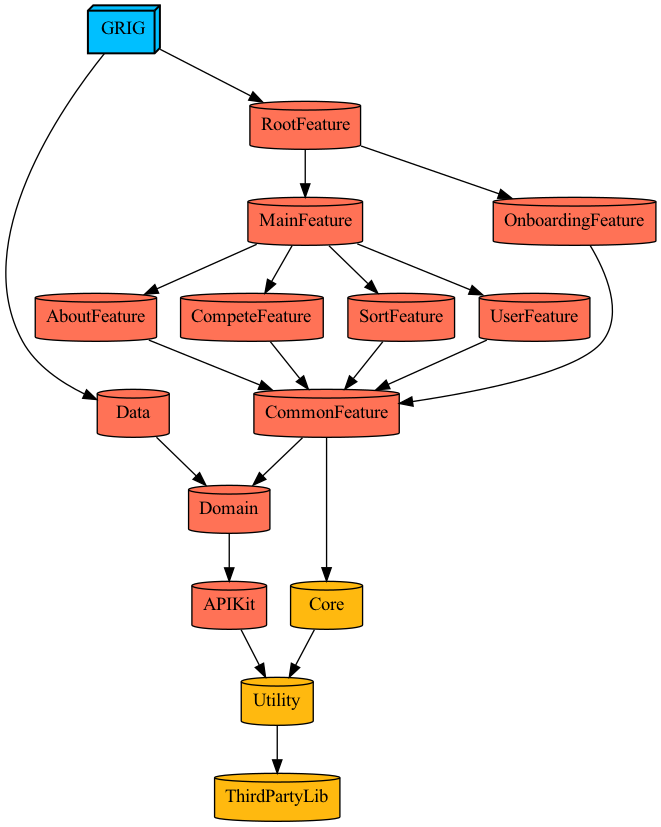

# GRIG - Github Rank In GSM

## ✨ Summary
광주소프트웨어마이스터고등학교 학생들의 Github 활동 장려 랭킹 서비스

<br>

## 🔗 Links
AppStore - https://apps.apple.com/kr/app/gri-g/id1622010590

<br>

## 📸 Screenshots


## 🤔 Experiences
- Tuist를 사용한 모듈화
- Feature(Presentation), Data, Domain의 Clean Architecture를 기반으로 한 레이어 설계
- Feature는 도메인 관점에서 분리하며 각 RIB별로 분리
- Apollo-iOS를 사용한 GraphQL API와 통신

<details>
<summary>모듈 구조</summary>


</details>

<br>

## 📚 Tech Stack
- Swift
- Tuist
- RIBs
- Apollo-iOS
- RxSwift
- Clean Architecture

<br>

## 🏃‍♀️ Run Project
```bash
$ curl -Ls https://install.tuist.io | bash
$ brew install make

$ make generate
$ xed .
```

<br>

## ⭐️ Key Function
### 메인
- 학생들의 Github 활동을 랭킹으로 확인
- Github 활동, 기수를 기준으로 정렬
- 유저를 탭하여 자세한 정보 확인
  
<div>
  
  
  
</div>

### 분석
- 내가 선택한 유저와 분석 지표
- 분석 결과물을 공유 가능


### 온보딩
- 유저가 앱에 처음으로 진입할 때 온보딩 화면을 통해 앱의 기능 설명


